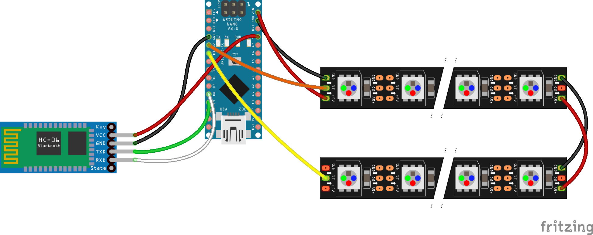
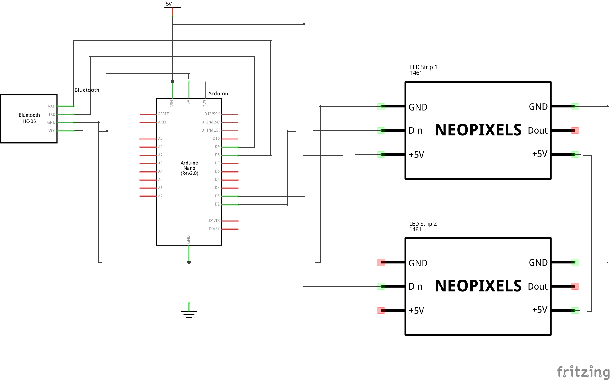

# LED-Control

This is a project of mine for an App which is able to control a NeoPixel LED strip through bluetooth connection and an Arduino (Nano).
The code is now fully functional and the updated version is now on the Google Play store.

The program itself is able to control two separate LED strips. I would not recommend to use more than 80 single LEDs per strip, otherwise the framerate and possibly dataloss over the serial connection could impair the good experience.

## Hardware

To control your own LEDs you will first have to assemble the hardware components. You will need
 - An Arduino, it basically doesn't matter which one, but I used the Nano because it's compact form factor. You might have to adjust the pins in the sketch
 - A bluetooth serial adapter (HC-05, HC-06). I used the HC-06 and cannot tell anything about the HC-05.
 - Some kind of powersupply, keep in mind that for 12V LEDs, you will need an extra 5V supply for the Arduino.

In the beginning you have to connect the devices in the following way: 

Idk why the Neopixels are so big in the Fritzing Library.

